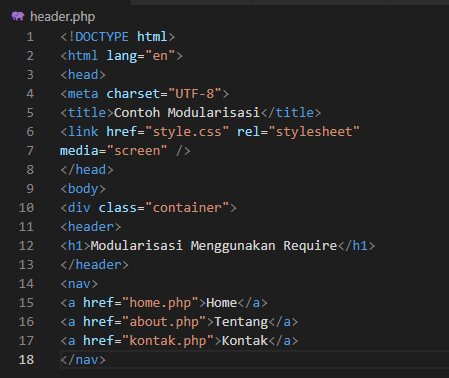
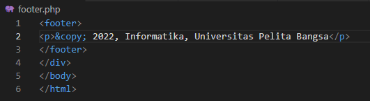
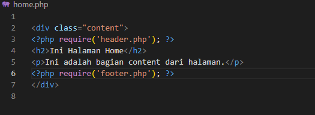
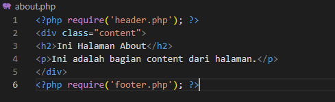
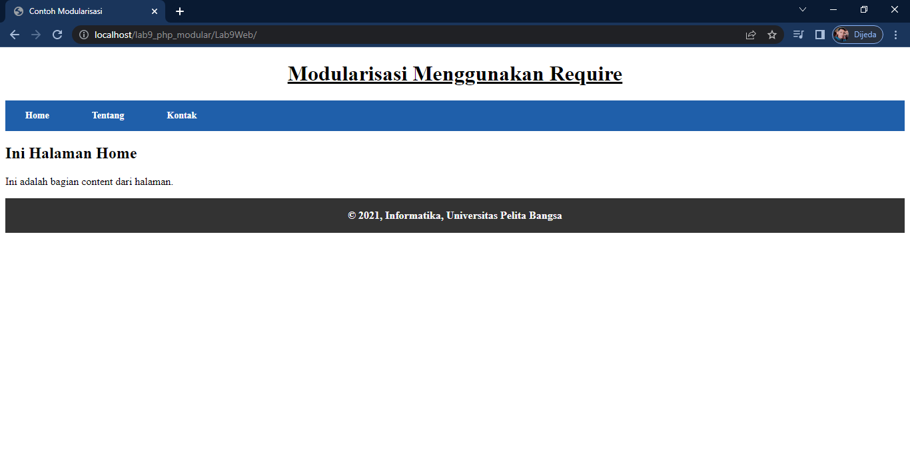
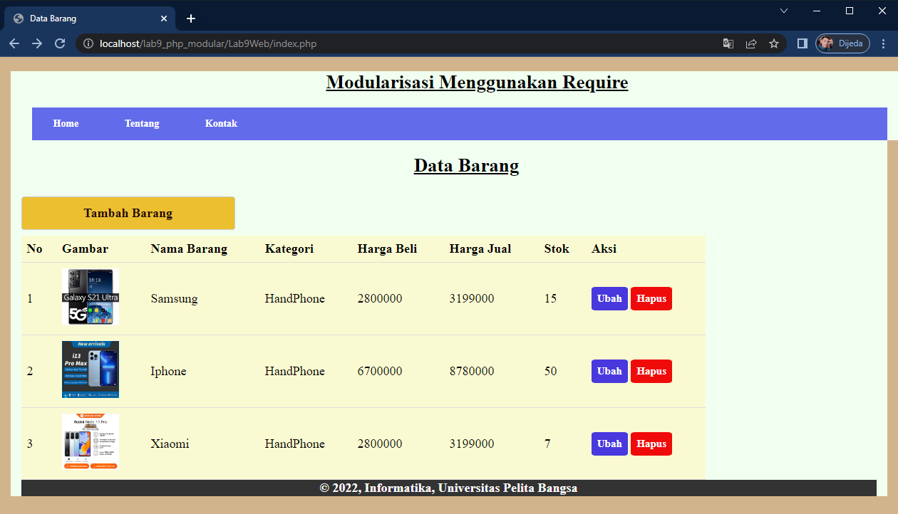
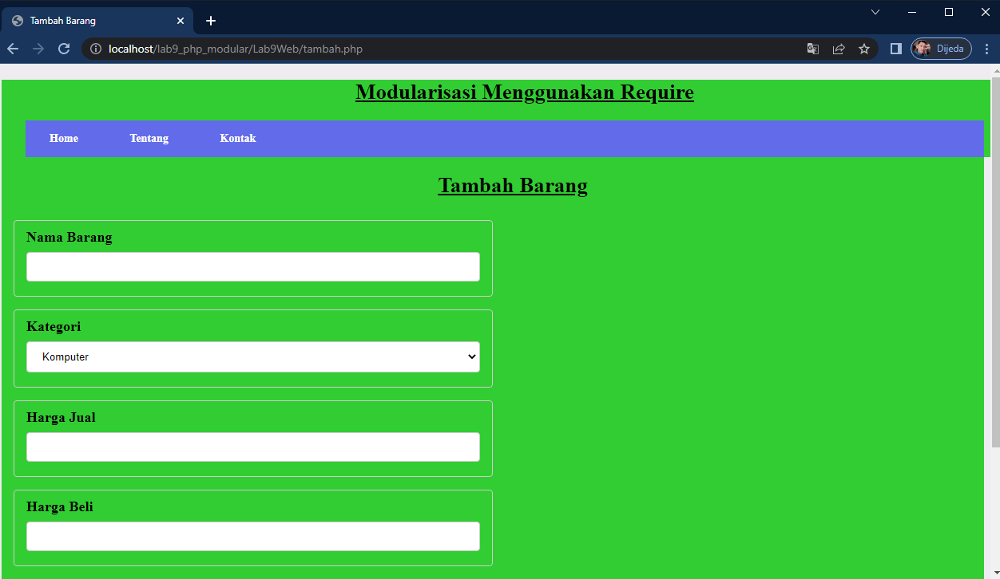
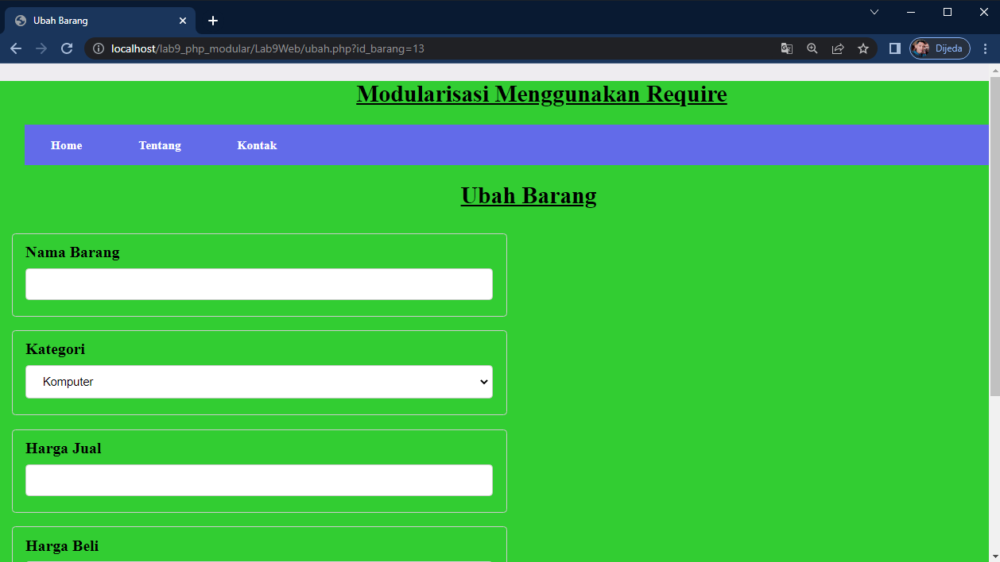

# Lab9Web
## Praktikum 9 PHP Modular

### Langkah-langkah praktikum

1. File Baru dengan nama header.php

2. File Baru dengan nama footer.php

3. File Baru dengan nama home.php

4. File Baru dengan nama about.php

ini hasil tampilanya

Pertanyaan & Tugas
`Implementasikan konsep modularisasi pada kode program praktikum 8 tentang database, sehingga setiap halamannya memiliki template tampilan yang sama.`

Hasil dari implementasi dari konsep parktikum 8 dengan parktikum 9

